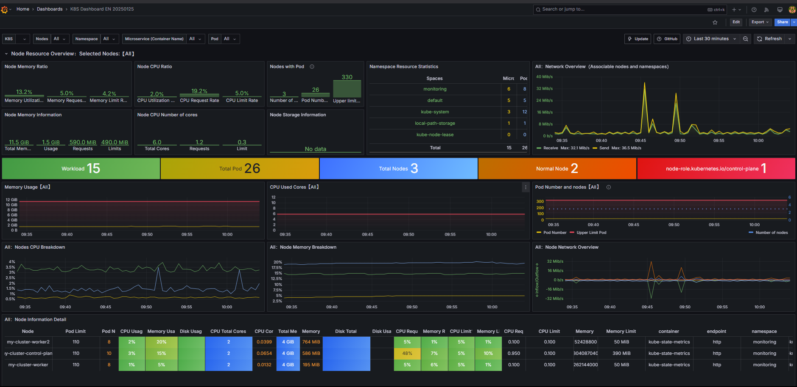

# **K8s Kind Voting App**  

A Kubernetes-based **voting application** deployed on an **AWS EC2** instance using **Kind, Argo CD, Grafana, and Prometheus** for monitoring and observability.  

## **📌 Overview**  

This project demonstrates **automated deployment** and **observability** of a microservices-based voting application using Kubernetes and Argo CD. It includes:  

✅ A **frontend voting app** (Python) for users to vote between two options.  
✅ **Redis** as a message queue to collect votes.  
✅ A **.NET worker service** to process votes and store them in a database.  
✅ A **PostgreSQL database** for persistent storage.  
✅ A **results dashboard** (Node.js) displaying real-time voting results.  
✅ **Argo CD for GitOps-based continuous deployment.**  
✅ **Grafana and Prometheus** for real-time monitoring and observability.  

---

## **📁 Architecture**  

  

This project follows a **modular microservices architecture**, with each component deployed as a containerized application managed by Kubernetes.  

---

## **🛠️ Tech Stack**  

| Technology | Purpose |
|------------|---------|
| **Kubernetes (Kind)** | Cluster orchestration |
| **Docker** | Containerization |
| **Argo CD** | GitOps-based deployment |
| **Grafana & Prometheus** | Monitoring & observability |
| **Python Flask** | Voting app frontend |
| **Redis** | Message queue |
| **.NET** | Worker service |
| **PostgreSQL** | Database |
| **Node.js** | Results app frontend |

---

## **🚀 Deployment Guide**  

### **🔹 Prerequisites**  

Ensure the following tools are installed:  
- AWS EC2 instance (Ubuntu)  
- Docker & Docker Compose  
- Kubernetes (Kind)  
- `kubectl` CLI  
- Argo CD  
- Helm  

### **🔹 Installation Steps**  

1️⃣ **Clone the repository:**  
```bash
git clone https://github.com/SriteshSuranjan/k8s-kind-voting-monitoring-app.git
cd k8s-kind-voting-monitoring-app
```

2️⃣ **Create a Kubernetes cluster using Kind:**  
```bash
kind create cluster --name voting-app
```

3️⃣ **Deploy the application components:**  
```bash
kubectl apply -f k8s/
```

4️⃣ **Install and configure Argo CD:**  
```bash
kubectl create namespace argocd
kubectl apply -n argocd -f https://raw.githubusercontent.com/argoproj/argo-cd/stable/manifests/install.yaml
```

5️⃣ **Access Argo CD UI & Login:**  
```bash
kubectl port-forward svc/argocd-server -n argocd 8080:443
```
Login using the initial password:  
```bash
kubectl -n argocd get secret argocd-initial-admin-secret -o jsonpath="{.data.password}" | base64 -d; echo
```

6️⃣ **Set up monitoring with Grafana & Prometheus:**  
```bash
kubectl apply -f monitoring/
```

7️⃣ **Access Services:**  
| Service | Command |
|---------|---------|
| **Voting App** | `kubectl port-forward svc/vote 5000:80` |
| **Results Dashboard** | `kubectl port-forward svc/result 5001:80` |
| **Grafana** | `kubectl port-forward svc/grafana 3000:3000` |
| **Prometheus** | `kubectl port-forward svc/prometheus 9090:9090` |

---

## **📊 Observability**  

### **Grafana Dashboard**  
  

### **Prometheus Metrics**  
  

---

## **📝 Contribution Guidelines**  

We welcome contributions! Follow these steps:  

1️⃣ **Fork** the repository  
2️⃣ **Create a new branch** (`feature-new-component`)  
3️⃣ **Commit your changes** (`git commit -m "Add new feature"`)  
4️⃣ **Push to your branch** (`git push origin feature-new-component`)  
5️⃣ **Submit a pull request** 🚀  

---

## **📜 License**  

This project is licensed under the **Apache-2.0 License**.  

---

## **📧 Contact**  

📌 **GitHub:** [Sritesh Suranjan](https://github.com/SriteshSuranjan)  
📌 **LinkedIn:** [Sritesh Suranjan](https://www.linkedin.com/in/sriteshsuranjan/)  

---
